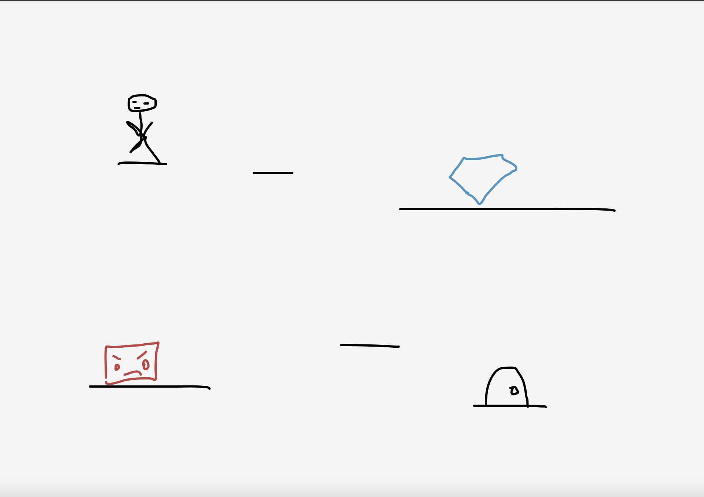
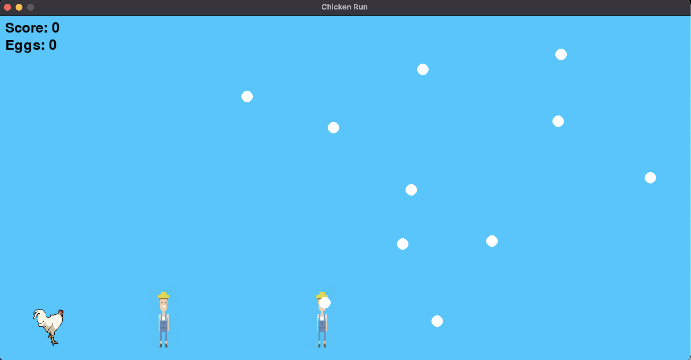

:warning: Everything between << >> needs to be replaced (remove << >> after replacing)

# << Chicken Run! >>
## CS110 Final Project  << Spring, 2024 >>

## Team Members

<< Ava Rongo >>

***

## Project Description

<< For my final, I made a game similar to Dino Run but it is a Chicken! The Chicken must dodge the farmers trying to capture it while also collecting as many of its eggs as possible! >>

***    

## GUI Design

### Initial Design

### Final Design

## Program Design

### Features

1. << Start Menu >>
2. << Moveable Character >>
3. << Obstacles >>
4. << Eggs to collect >>
5. << Ending Screen >>

### Classes

- << class Chicken: is the player class which defines the chickens initial position, movement up (jump), updates its position, and rests it. >>
- << class Farmer: the class which holds the moving obstacles. This defines their initial position and their updated position as the game runs. >>
- << class egg: this class draws the eggs that appear on the screen to be collected. This defines their initial position and updates it as the game runs. >>
- << class Score: this class keeps track of the score and counts the eggs as the game continues. >>
- << class Mainmenu: this class draws the main menu or starting screen and defines its initial position. >>
- << class Endscreen: this class, like the main menu, draws the ending screen and defines its initial position. >>
- << class Controller: this class imports all of the previous classes. It defines all of the initial positons and parameters for each of the variables in the other classes. It spawns the eggs and farmers as the game runs, updating their position based on the speed variable as they move across the screen. It checks for collisions and ends the game if the player collides with the farmer. It keeps the game in a continuous loop until a collision occurs. It also adds the score and eggs up based on if the egg is touched by the player and the score goes up for each farmer passed. >>

## ATP

Test Case 1: Menu Navigation
- Test Description: Test starting the game
- Test Steps:
1. Press spacebar
2. Verify that spacebar starts the game
- Expected Outcome: Pressing spacebar takes you to the game, allowing you to play.

Test Case 2: Player Movement
- Test Description: Verify the player can jump
- Test Steps:
1. Start the game
2. Press spacebar
3. Verify that the chicken jumps
- Expected Outcome: The chicken should jump and come back down when spacebar is pressed.

Test Case 3: Collision Detection:
- Test Description: Ensure collisions are detected correctly
- Test Steps:
1. Start the game
2. Watch the farmer move towards the chicken
3. Verify a farmer collides with the chicken
4. Jump over the farmer moving towards chicken
5. Verify no farmer collides with the chicken
- Expected Outcome: Farmer should correctly collide with the chicken.

Test Case 4: Game Over Condition
- Test Description: Confirm the game ends when collision occurs
- Test Steps:
1. Start the game
2. Play until collision between farmer and chicken occurs
3. Verify that the end screen pops up and the game ends
- Expected Outcome: The game should go black with the end screen appearing with the option to retry. 

Test Case 5: Error Handling
- Test Description: Verify that the program handles unexpected inputs well
- Test Steps:
1. Start the game
2. Enter invalid characters during gameplay (ex. trying to jump with up arrow)
3. Verify that program does not crash
- Expected Outcome: The program will not crash when an expected input occurs, it will continue as it is supposed to, displaying the end screen when player dies